<div align="center">

<h1>EVEWorld</h1>

<h3>Evolution Supervision for Instance-Consistent Embodied World Models</h3>

<p><sub>Anonymous submission &nbsp;·&nbsp; under double-blind review</sub></p>

<p>
<a href="https://huggingface.co/spaces/WorldArena/WorldArena2.0"></a>
<a href="https://anonymous.4open.science/r/EVEWorld-release-C8B4"></a>


</p>

<p>On the <a href="https://huggingface.co/spaces/WorldArena/WorldArena2.0">WorldArena 2.0 Track 1</a> leaderboard our supervision model is listed as <code>Supervision_WM</code> — <b>6th in JEPA Similarity</b>, <b>17th overall</b>.</p>

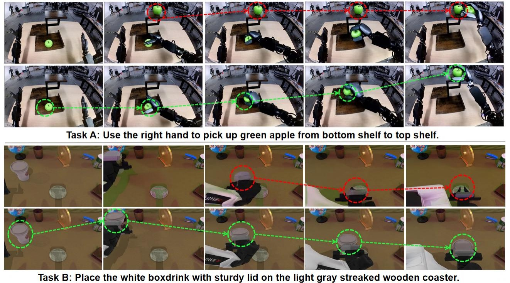

<p><sub><b>Model Laziness.</b> Under standard supervised fine-tuning, an embodied world model can reach the goal by <b>duplicating</b> the manipulated target (Task A) or by letting it <b>disappear</b> (Task B). <b>EVEWorld</b> keeps a single target instance that evolves continuously through the interaction. Dashed arrows trace target evolution over time; red marks the baseline and green marks ours.</sub></p>

</div>

## Overview

Video world models are emerging as scalable data engines for embodied intelligence: they roll out robot-interaction videos that expand the behaviors and environments available for policy learning. But visual plausibility does not guarantee a valid target trajectory. A rollout can look globally coherent while the manipulated object **duplicates**, **disappears**, or **changes identity** part-way through the interaction — a process-level failure we call **Model Laziness**.

Frame-level reconstruction admits a shortcut: it can satisfy appearance and endpoint cues without conserving the manipulated instance throughout the interaction. **EVEWorld** closes that gap with evolution supervision — directly supervising how the target evolves over time, rather than only how each frame looks.

<p align="center">
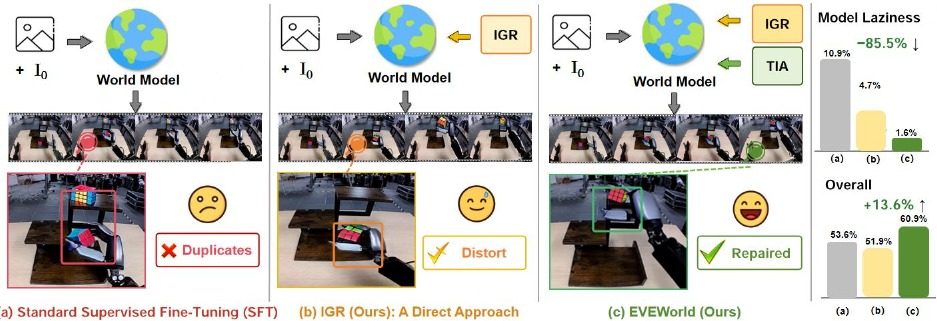
</p>

<p align="center"><sub><b>Why evolution supervision.</b> <b>(a)</b> Standard SFT may reach the goal by duplicating the manipulated target. <b>(b)</b> IGR alone suppresses duplication, but cross-frame distortion can remain. <b>(c)</b> EVEWorld combines IGR and TIA to preserve a single target with continuous evolution. Relative to Standard SFT, EVEWorld reduces MLR by <b>85.5%</b> and improves overall Gemini-IF by <b>13.6%</b>.</sub></p>

## Method

Three pieces, all inside the backbone — no test-time surgery, no extra sampling cost.

- **Instance-Guided Restoration (IGR).** We insert an extra target instance into clean demonstrations to build count-perturbed training pairs, and train the model to restore the original video in a pretrained VAE latent space. Reconstruction error inside the perturbed region is mildly up-weighted so the local conservation signal is not washed out by global reconstruction.
- **Temporal Instance Alignment (TIA).** Count alone is not enough — the target can be conserved and still distort or jump. TIA establishes local cross-frame target correspondence at a probed Transformer layer via feature transport and a contrastive correspondence loss, constraining identity and motion continuity.
- **Model Laziness Rate (MLR).** A deterministic detector-based metric that flags **persistent** target-instance count violations in a generated trajectory. Unlike per-frame plausibility scores, MLR is a process-level measurement over the rollout.

<p align="center">
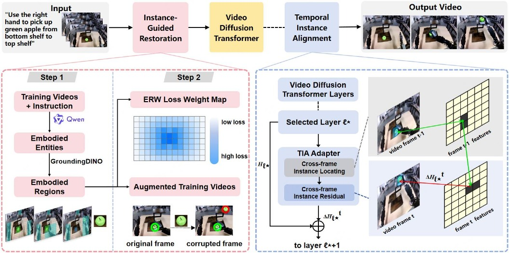
</p>

<p align="center"><sub><b>The overall architecture of EVEWorld.</b> <b>IGR</b> (left) suppresses target duplication by restoring clean videos from duplicate-corrupted inputs, while <b>TIA</b> (right) aligns target features across adjacent frames to preserve identity and temporal continuity.</sub></p>

## Results

### DreamGenBench

EVEWorld attains the best score on every metric, cutting MLR from 10.94% to **1.59%** — an **85.5% relative reduction** — while *improving* both instruction-following judges. No fidelity-for-consistency trade-off.

| Method | MLR (%) ↓ | Qwen-IF (%) ↑ | Gemini-IF (%) ↑ |
|---|---|---|---|
| CogVideoX1.5-5B-I2V | 28.57 | 38.89 | 5.56 |
| Wan2.2-TI2V-5B | 18.03 | 38.89 | 10.32 |
| Wan2.2-I2V-A14B | 11.11 | 64.29 | 15.87 |
| Cosmos-Predict2-2B | 15.00 | 62.70 | 24.60 |
| GigaWorld-0 | 13.33 | 79.37 | 60.19 |
| Standard SFT | 10.94 | 73.81 | 53.57 |
| **EVEWorld (ours)** | **1.59** | **80.16** | **60.85** |

### Generalization

The same framework transfers across domains, training distributions, and backbones.

| Benchmark (setting) | Metric | Baseline | EVEWorld | Change |
|---|---|---|---|---|
| WorldArena 1.0 (zero-shot domains) | Overall ↑ | 53.95 | **56.76** | +5.21% |
| WorldArena 1.0 (zero-shot domains) | MLR (%) ↓ | 27.39 | **13.38** | −51.20% |
| EWMBench (AgiBot training dist.) | Motion ↑ | 61.51 | **63.65** | +3.50% |
| EWMBench (AgiBot training dist.) | Overall ↑ | 3.7066 | **3.7525** | +1.20% |
| RoboTwin (FlowWAM backbone) | MLR (%) ↓ | 52.05 | **35.21** | −16.84 pp |
| RoboTwin (FlowWAM backbone) | PSNR (dB) ↑ | 12.218 | **12.765** | +4.48% |

### PBench

Physical-QA accuracy on PBench as the output duration grows from 3.8 s to 19.8 s. Both models degrade with length, but the post-trained model improves every dimension over the pretrained backbone, and the margin widens with the horizon: averaged over the three longest durations it leads by **1.65** Domain, **1.95** Phys., and **4.24** Time points.

| Setting | Metric | GigaWorld-0 (pretrained) | Post-trained | Change |
|---|---|---|---|---|
| Mean over 3.8–19.8 s | Domain ↑ | 74.23 | **74.93** | +0.70 |
| Mean over 3.8–19.8 s | Phys. ↑ | 82.01 | **83.64** | +1.63 |
| Mean over 3.8–19.8 s | Space ↑ | 78.00 | **78.30** | +0.30 |
| Mean over 3.8–19.8 s | Time ↑ | 64.29 | **66.47** | +2.18 |
| Mean over ≥ 9.8 s | Domain ↑ | 69.61 | **71.26** | +1.65 |
| Mean over ≥ 9.8 s | Phys. ↑ | 79.98 | **81.93** | +1.95 |
| Mean over ≥ 9.8 s | Time ↑ | 55.03 | **59.27** | +4.24 |

<details>
<summary><b>Component ablation, training dynamics, and additional analysis</b></summary>

<br>

Both components contribute, and they are complementary: IGR drives the count signal, TIA the continuity signal, and only their combination reaches the best MLR *and* instruction following.

| Variant | IGR | TIA | Gemini-IF Env ↑ | Gemini-IF Object ↑ | Gemini-IF Behavior ↑ | Gemini-IF Overall ↑ | MLR (%) ↓ |
|---|---|---|---|---|---|---|---|
| Standard SFT | | | 51.72 | 42.00 | 67.02 | 53.57 | 10.94 |
| IGR only | ✓ | | 49.43 | 36.67 | **69.50** | 51.85 | 4.69 |
| TIA only | | ✓ | 55.17 | 42.67 | 68.79 | 55.29 | 7.94 |
| **EVEWorld** | ✓ | ✓ | **72.41** | **50.33** | 64.89 | **60.85** | **1.59** |

<p align="center">
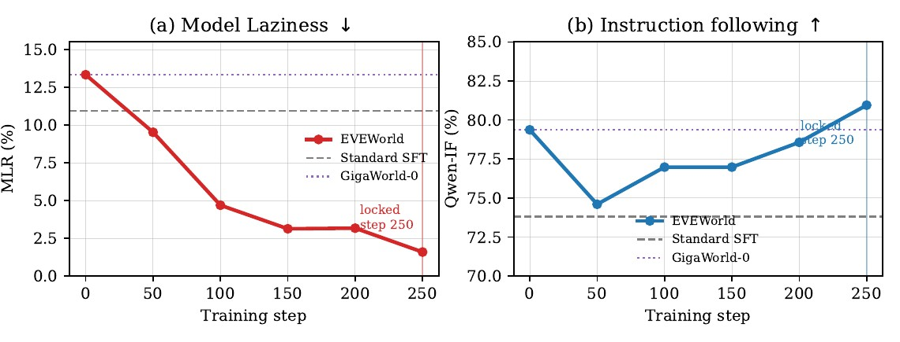
</p>

<p align="center"><sub><b>Training progress.</b> MLR decreases as training proceeds while instruction following rises over the same checkpoints.</sub></p>

<p align="center">
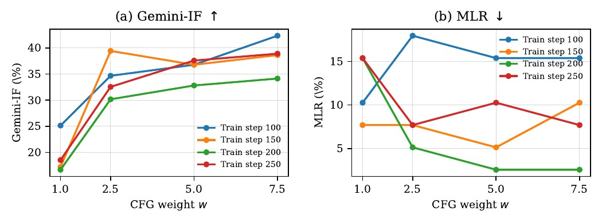
</p>

<p align="center"><sub><b>Guidance sensitivity.</b> Raising the CFG weight improves instruction following at every checkpoint, while MLR varies non-monotonically.</sub></p>

<p align="center">
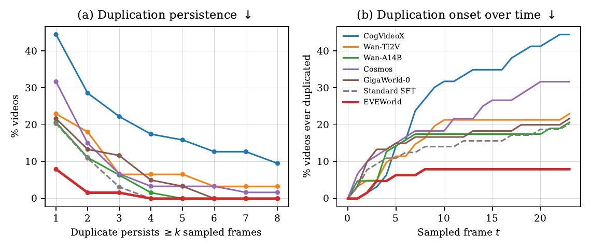
</p>

<p align="center"><sub><b>Persistence.</b> The few remaining count violations under EVEWorld are transient, whereas those of general image-to-video models persist across more sampled frames.</sub></p>

<p align="center">
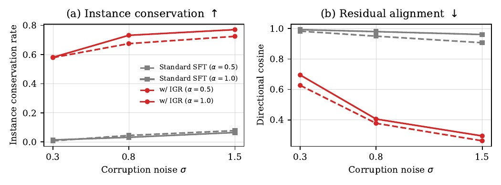
</p>

<p align="center"><sub><b>Mechanism.</b> After restoration training, the residual error is not merely smaller but no longer aligned with the injected duplicate.</sub></p>

</details>

## Qualitative Results

All methods are shown at matched stages of the same instruction. Red boxes mark count errors; green boxes mark the corresponding conserved target under EVEWorld. The examples cover both count-**increase** (duplication) and count-**decrease** (disappearance) failures.

<p align="center">
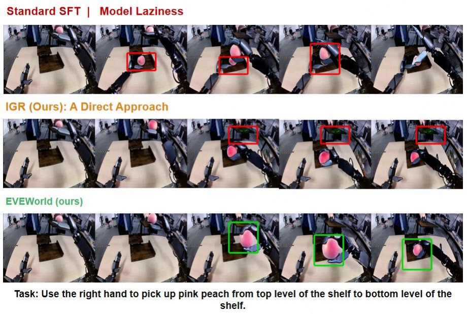
</p>

<p align="center">
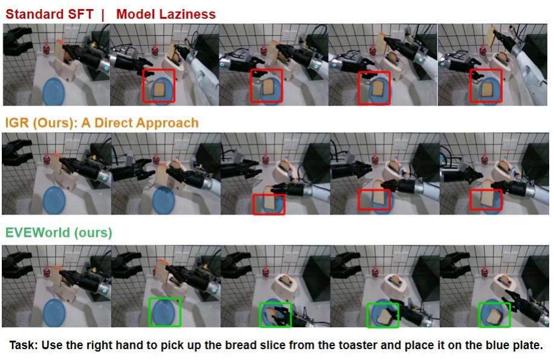
</p>

<p align="center">
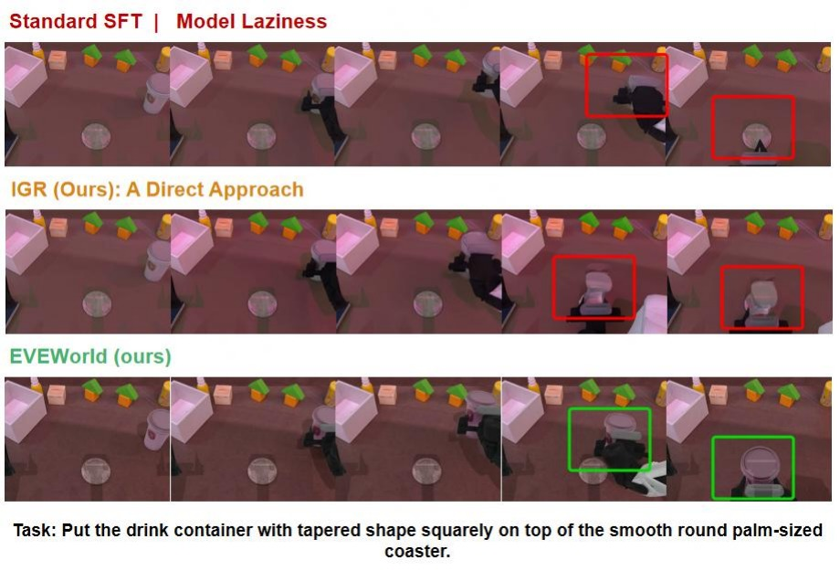
</p>

<p align="center">
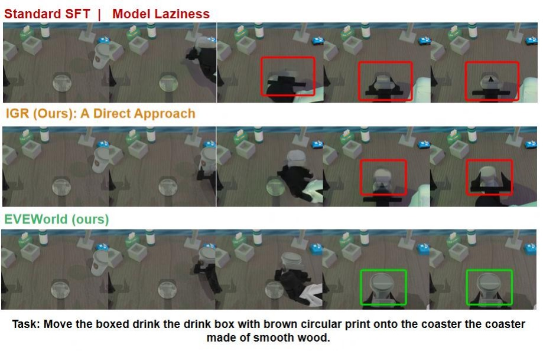
</p>

## Repository Layout

| Directory | Contents |
|---|---|
| [`eveworld/`](eveworld/) | **Method core**: IGR corruption & restoration, TIA correspondence, training, the MLR metric, evaluation tooling, and the five alternative designs analyzed in the paper |
| [`benchmarks/`](benchmarks/) | Evaluation pipelines: DreamGenBench, WorldArena (1.0 / 2.0), EWMBench (AgiBot), RoboTwin–FlowWAM, PBench, and cross-model baselines |
| [`giga-world-0/`](giga-world-0/) | Pinned snapshot of the [GigaWorld-0](https://github.com/open-gigaai/giga-world-0) backbone (model package, configs, training/inference scripts) |
| [`giga-models/`](giga-models/) | Pinned snapshot of the [GigaModels](https://github.com/open-gigaai/giga-models) framework (training infrastructure used by the backbone) |
| [`docs/`](docs/) | Environment setup, data preparation, and end-to-end reproduction guides |
| [`assets/`](assets/) | Figures used by this README and by the repository's static entry page |

> **Note on vendored code.** `giga-world-0/` and `giga-models/` are plain-directory snapshots (not git submodules), pinned to the exact versions used in our experiments so that the release is self-contained. The FlowWAM backbone used for the cross-backbone experiment is referenced externally; see [`benchmarks/robotwin_flowwam/`](benchmarks/robotwin_flowwam/).

## Getting Started

```bash
conda create -n eveworld python=3.11.10 -y
conda activate eveworld
pip install -e ./giga-models
# plus the evaluation/training dependencies documented in docs/ENVIRONMENT.md
```

See [`docs/ENVIRONMENT.md`](docs/ENVIRONMENT.md) for the full dependency list, CUDA notes, and the reference environment export.

1. **Prepare data & checkpoints** — [`docs/DATASETS.md`](docs/DATASETS.md).
2. **Train EVEWorld (IGR + TIA)** — method-side pipeline in [`eveworld/pipeline/`](eveworld/pipeline/), training launch in [`benchmarks/dreamgenbench/`](benchmarks/dreamgenbench/).
3. **Generate & evaluate** — per-benchmark guides under [`benchmarks/`](benchmarks/).
4. **End-to-end reproduction** — [`docs/REPRODUCTION.md`](docs/REPRODUCTION.md).

## Citation

```bibtex
@misc{eveworld2027,
  title  = {EVEWorld: Evolution Supervision for Instance-Consistent Embodied World Models},
  author = {Anonymous},
  year   = {2027},
  note   = {Under double-blind review}
}
```

## License

This project is licensed under the Apache License 2.0 — see [LICENSE](LICENSE). Vendored snapshots retain their original licenses.
