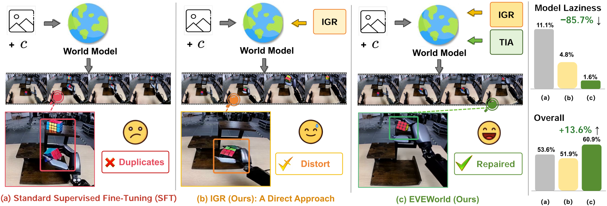
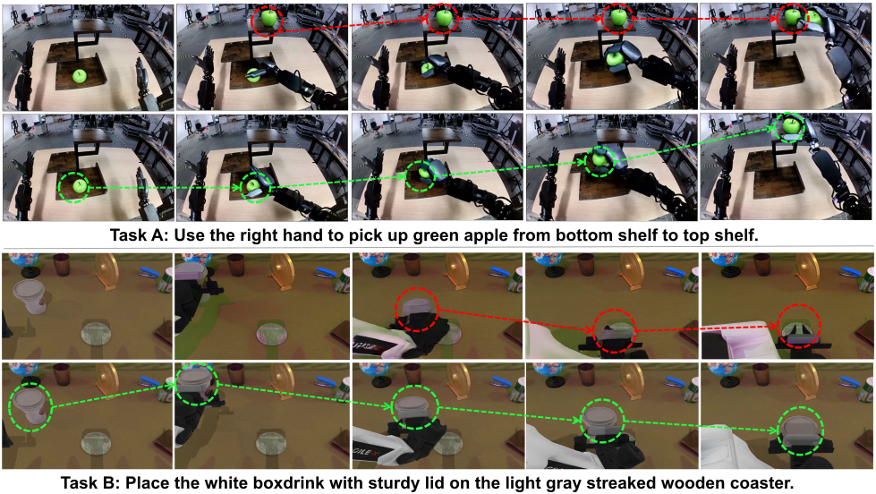
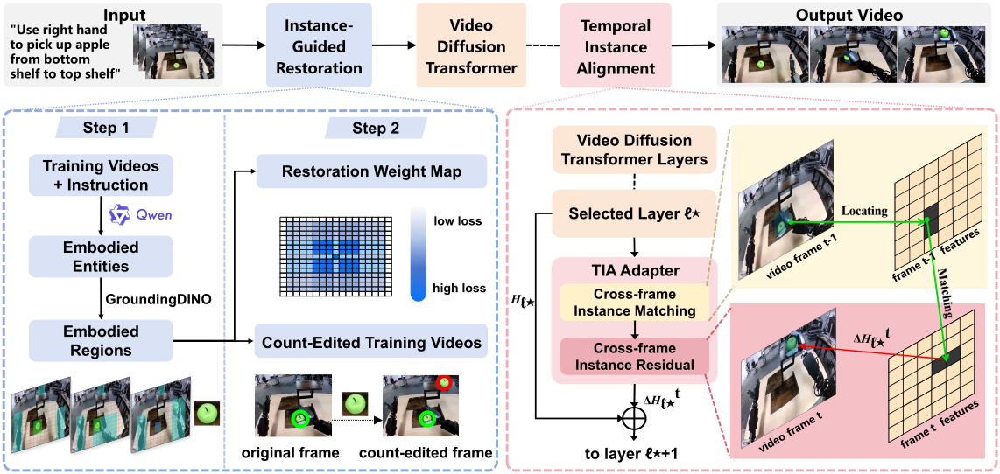

<div align="center">

<h1>EVEWorld</h1>

<h3>Physical Evolution Supervision for Embodied World Models</h3>

<p><sub>Anonymous submission &nbsp;·&nbsp; under double-blind review</sub></p>

<p>
  Project Page (soon) &nbsp;·&nbsp;
  <a href="#quick-start">Quick Start</a> &nbsp;·&nbsp;
  <a href="#reproducing-the-paper">Reproduction</a> &nbsp;·&nbsp;
  <a href="#citation">BibTeX</a>
</p>

<p>
<a href="https://huggingface.co/spaces/WorldArena/WorldArena2.0"></a>


<a href="LICENSE"></a>
</p>

</div>

## Overview

Visual plausibility does not guarantee a valid target trajectory. A rollout can look globally
coherent while the manipulated object duplicates, disappears, or changes identity part-way
through the interaction — a process-level failure we call **Model Laziness**.

**EVEWorld** supervises how the target evolves, not only how each frame looks.
**Instance-Guided Restoration (IGR)** restores clean demonstrations from count-perturbed
inputs, and **Temporal Instance Alignment (TIA)** aligns the target across adjacent frames.
The two objectives are trained jointly, and inference needs nothing beyond the backbone
itself. **Model Laziness Rate (MLR)** measures whether a count violation persists across a
rollout, which frame-level fidelity scores do not capture.

Quantitative and qualitative results are in the paper.

## 🏆 WorldArena 2.0 Leaderboard

Our FlowWAM-based submission, **Supervision_WM**, is listed on
**WorldArena 2.0 Track 1 — Simulator Video Quality** with an EWMScore-P of 70.17,
ranking **6th in JEPA Similarity** and **17th overall**.

<p align="center">
  <a href="https://huggingface.co/spaces/WorldArena/WorldArena2.0">
    
  </a>
</p>

<p align="center">
  <strong>70.17 EWMScore-P</strong>
  &nbsp;·&nbsp;
  <strong>6th in JEPA Similarity</strong>
  &nbsp;·&nbsp;
  <strong>17th overall</strong>
</p>

<p align="center">
  <a href="https://huggingface.co/spaces/WorldArena/WorldArena2.0"><strong>View the official leaderboard ↗</strong></a>
</p>

<p align="center">
  
</p>

<p align="center"><em>EVEWorld combines restoration supervision for target-instance consistency with temporal alignment for cross-frame consistency.</em></p>

<p align="center">
  
</p>

<p align="center"><sub><b>Model Laziness.</b> Under standard supervised fine-tuning an embodied world model can reach the goal by duplicating the manipulated target, or by letting it disappear. EVEWorld keeps a single target instance that evolves continuously through the interaction.</sub></p>

## Quick Start

### Main GigaWorld-based setting

```bash
conda env create -f envs/gigaworld.yaml
conda activate gigaworld
pip install -e ".[train,eval]"
python scripts/setup/check_environment.py
```

`python scripts/setup/check_environment.py` exits non-zero only when a core item is missing; optional items are reported and otherwise ignored unless `--strict` is given.

### Evaluation only

```bash
conda env create -f envs/evaluation.yaml
conda activate eveworld-eval
pip install -e ".[eval]"
```

### FlowWAM / RoboTwin

```bash
conda env create -f envs/flowwam.yaml
conda activate flowwam
pip install -e ".[train,eval]"
```

The backbones stay upstream: clone them into `third_party/` first (see
[Backbone setup](#backbone-setup)) and install the checkout the recipe imports. The judge
endpoints and the CUDA notes are in [`docs/ENVIRONMENT.md`](docs/ENVIRONMENT.md).

The main setting was trained on 8× NVIDIA H20Z GPUs with an effective batch size of 64.

## Backbone setup

The two backbones stay upstream and are **not** part of this repository — the root `.gitignore`
drops `third_party/giga-world-0/`, `third_party/giga-models/` and `third_party/FlowWAM/` — so
clone them into `third_party/` first (see [`third_party/README.md`](third_party/README.md)).
`giga-models` is the framework snapshot the training code imports, so install that checkout into
the same environment; the model weights and the GR1 fine-tuning split are then fetched by the
upstream scripts:

```bash
pip install -e third_party/giga-models
bash third_party/giga-world-0/scripts/download_video_pretrain_hf.sh
bash third_party/giga-world-0/scripts/download_gr1_finetune_dataset_hf.sh
```

FlowWAM is cloned the same way, or pointed at with `FLOWWAM_ROOT`. The RoboTwin pipeline under
[`benchmarks/robotwin_flowwam/`](benchmarks/robotwin_flowwam/) documents the rest.

## Method

**Instance-Guided Restoration (IGR).** IGR inserts an extra target instance into clean
demonstrations to build count-perturbed training pairs, then trains the model to restore the
original video in the backbone's latent space. Reconstruction error inside the perturbed
region is mildly up-weighted, so the local conservation signal is not washed out by the
global reconstruction term.

**Temporal Instance Alignment (TIA).** A conserved count is not enough: the target can still
deform or jump between frames. TIA establishes target correspondence at a probed transformer
layer through feature transport and a contrastive correspondence loss, which constrains
identity and motion continuity.

**Model Laziness Rate (MLR).** MLR runs a detector over a generated rollout and flags
persistent departures from the initial target-instance count. It is anchored on the initial
state and excludes robot-supported occlusion, so transient detector noise does not count as a
violation.

<p align="center">
  
</p>

## Reproducing the paper

| Paper artifact | Entry point |
|---|---|
| Main results on DreamGenBench | [`benchmarks/dreamgenbench/`](benchmarks/dreamgenbench/) |
| WorldArena zero-shot domain transfer and the MLR protocol | [`benchmarks/worldarena/`](benchmarks/worldarena/) |
| EWMBench transfer on AgiBot | [`benchmarks/ewmbench/`](benchmarks/ewmbench/) |
| RoboTwin cross-backbone transfer | [`benchmarks/robotwin_flowwam/`](benchmarks/robotwin_flowwam/) |
| Component ablation | [`eveworld/pipeline/ablation/`](eveworld/pipeline/ablation/) |
| External I2V baselines | [`benchmarks/baselines/`](benchmarks/baselines/) |

The cluster scripts are templates: dataset roots, conda locations, and checkpoint paths are set
through environment variables, and every `kjob_*` payload takes `KEY=VALUE` overrides. See
[`docs/REPRODUCTION.md`](docs/REPRODUCTION.md) for the per-artifact protocols.

## Data and checkpoints

Datasets and checkpoints stay outside the repository. Data-side roots follow the `GAGI_ROOT`
convention defined in `eveworld/common/env.sh`. See [`docs/DATASETS.md`](docs/DATASETS.md) for
the expected on-disk layouts and for the scripts that freeze the reported splits.

## Repository structure

```text
EVEWorld/
├── assets/       figures used by this README
├── benchmarks/   DreamGenBench, WorldArena, EWMBench, RoboTwin-FlowWAM, PBench, external baselines
├── docs/         environment, data preparation, and reproduction guides
├── eveworld/     the library: IGR, TIA, MLR, training and evaluation pipelines
└── third_party/  clone targets for the two upstream backbones (checkouts are gitignored)
```

## Documentation

| Document | Covers |
|---|---|
| [`docs/ENVIRONMENT.md`](docs/ENVIRONMENT.md) | environments, dependencies, CUDA notes, API credentials |
| [`docs/DATASETS.md`](docs/DATASETS.md) | data and checkpoint preparation |
| [`docs/REPRODUCTION.md`](docs/REPRODUCTION.md) | end-to-end reproduction of the paper artifacts |

## Citation

```bibtex
@misc{eveworld2027,
  title  = {EVEWorld: Physical Evolution Supervision for Embodied World Models},
  author = {Anonymous Author(s)},
  year   = {2027},
  note   = {Under double-blind review}
}
```

## License

Released under the [Apache-2.0 License](LICENSE). The vendored backbones and the external
tools listed in the documentation keep their own licenses.

## Acknowledgements

EVEWorld builds on the GigaWorld-0 and FlowWAM backbones, and uses GroundingDINO and SAM2 for
target localization in the MLR protocol.
